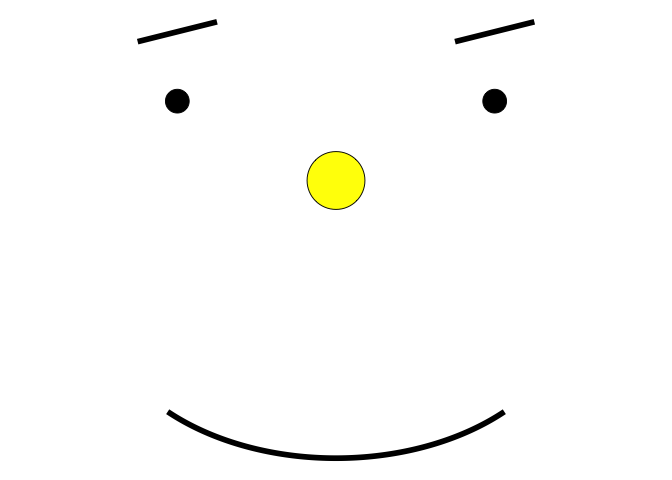

Practicing RMarkdown with Github
================
Gabriel Crone
2025-08-03

This is a document practicing uploading changes from RMarkdown to
Github. Please enjoy the plot below.

``` r
library(tidyverse)
```

    ## ── Attaching core tidyverse packages ──────────────────────── tidyverse 2.0.0 ──
    ## ✔ dplyr     1.1.4     ✔ readr     2.1.5
    ## ✔ forcats   1.0.0     ✔ stringr   1.5.1
    ## ✔ ggplot2   3.5.2     ✔ tibble    3.3.0
    ## ✔ lubridate 1.9.4     ✔ tidyr     1.3.1
    ## ✔ purrr     1.1.0     
    ## ── Conflicts ────────────────────────────────────────── tidyverse_conflicts() ──
    ## ✖ dplyr::filter() masks stats::filter()
    ## ✖ dplyr::lag()    masks stats::lag()
    ## ℹ Use the conflicted package (<http://conflicted.r-lib.org/>) to force all conflicts to become errors

``` r
# Face
face <- data.frame(x = 0, y = 0)

# Eyes (already lowered)
eyes <- data.frame(
  x = c(-0.4, 0.4),
  y = c(0.2, 0.2)
)

# Smile
theta <- seq(pi/4, 3*pi/4, length.out = 100)
smile <- data.frame(
  x = 0.6 * cos(theta),
  y = -0.4 * sin(theta) - 0.3
)

# Eyebrows (little lines above each eye)
eyebrows <- data.frame(
  x = c(-0.5, 0.3),
  xend = c(-0.3, 0.5),
  y = c(0.35, 0.35),
  yend = c(0.4, 0.4)
)

ggplot() +
  # Face
  geom_point(data = face, aes(x = x, y = y), size = 20, shape = 21, fill = "yellow", color = "black") +
  # Eyes
  geom_point(data = eyes, aes(x = x, y = y), size = 8) +
  # Smile
  geom_path(data = smile, aes(x = x, y = y), size = 2) +
  # Eyebrows
  geom_segment(data = eyebrows, aes(x = x, xend = xend, y = y, yend = yend), size = 2) +
  coord_fixed() +
  theme_void()
```

    ## Warning: Using `size` aesthetic for lines was deprecated in ggplot2 3.4.0.
    ## ℹ Please use `linewidth` instead.
    ## This warning is displayed once every 8 hours.
    ## Call `lifecycle::last_lifecycle_warnings()` to see where this warning was
    ## generated.

<!-- -->
